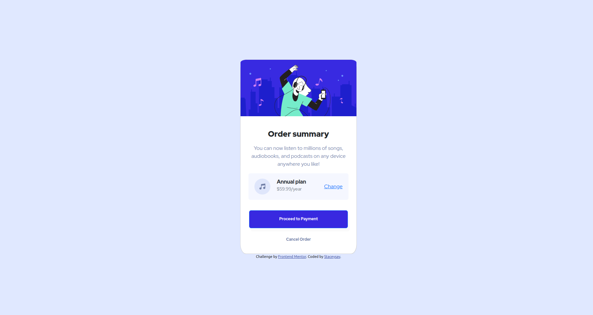

# Frontend Mentor - Order summary card solution

This is a solution to the [Order summary card challenge on Frontend Mentor](https://www.frontendmentor.io/challenges/order-summary-component-QlPmajDUj). Frontend Mentor challenges help you improve your coding skills by building realistic projects. 

## Table of contents

- [Frontend Mentor - Order summary card solution](#frontend-mentor---order-summary-card-solution)
  - [Table of contents](#table-of-contents)
  - [Overview](#overview)
    - [The challenge](#the-challenge)
    - [Screenshot](#screenshot)
    - [Links](#links)
  - [My process](#my-process)
    - [Built with](#built-with)
    - [Continued development](#continued-development)
    - [Useful resources](#useful-resources)
  - [Author](#author)

## Overview

### The challenge

Users should be able to:

- See hover states for interactive elements (the Proceed to Payment, Cancel Order and Change buttons change their color when hovered)

### Screenshot

Add a screenshot of your solution..

### Links

- Solution URL: [Add solution URL here](https://your-solution-url.com)
- Live Site URL: [Add live site URL here](https://your-live-site-url.com)

## My process

### Built with

- Semantic HTML5 markup
- CSS custom properties
- Flexbox
- Bootstrap
- Bootstrap CSS Grid

I decided to make this challenge using Bootstrap. 
The order summary component was created with the Card component.
To position it, I used Flexbox. Added `min-height` of 100vh to the <body> to make the body display 100% of the browser screen size. Added `display: flex` and `flex-direction: column` to align the card vertically using the body as reference. 
Added max-width.
I don't know how to add waves in the background. The shadow doesn't look as good as in the layout. Struggles with margins.

### Continued development

Use this section to outline areas that you want to continue focusing on in future projects. These could be concepts you're still not completely comfortable with or techniques you found useful that you want to refine and perfect.

### Useful resources

- Bootstrap documentation.

## Author

- Website - [Anastasia Savinova](https://staceysav.github.io/)
- Frontend Mentor - [@staceysav](https://www.frontendmentor.io/profile/@staceysav)
